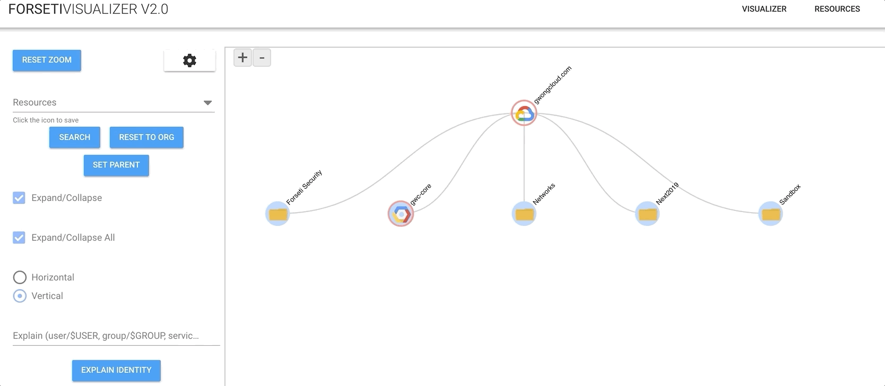

# Forseti Visualizer



Forseti Visualizer provides a visualization solution, based on [Forseti Security's](https://github.com/forseti-security/forseti-security) Inventorying and Violation modules.  Forseti Visualizer attempts to enable Google Cloud Platform users to better understand their GCP Organization Structure, while providing insights into policy adherence through identification of violations.

## Overview

This solution contains a frontend (forseti-visualizer-ui) and backend (forseti-api) component.  The frontend defaults to running on port 8081, while the backend runs on port 8080.  

### Frontend (forseti-visualizer-ui)

Written in:

* [node.js v10.0.0+](https://nodejs.org/en/)
* [vue-cli](https://cli.vuejs.org/guide/installation.html)
* [d3v5](https://d3js.org/)

### Backend (forseti-api)

Written in:

* [express.js v4.16.1+](https://expressjs.com/)

## Getting Started (Local Development)

### forseti-visualizer-ui

Navigate to the forseti-visualizer-ui/ directory, install npm packages.

```bash
cd forseti-visualizer-ui/

# install the packages
npm install

# build the application
npm run build

# for developing just the UI - app is served on :8081
# npm start
```

### forseti-api

Navigate to forseti-api/.  Create a `source.env` file, which will should be sourced to set the appropriate ENV variables prior to runtime.  You will need to populate the fields below.  The HANDLE and CHANNEL are leveraged for the IAM Explain functionality.

```bash
# navigate to forseti-api
cd forseti-api/

# copy the most recent dist
cp -R ../forseti-visualizer-ui/dist ../forseti-api/dist-forseti-visualizer-ui

# create source.env file
cat > source.env << EOF
export CLOUDSQL_HOSTNAME="[IP HERE:127.0.0.1]"
export CLOUDSQL_USERNAME="[YOUR_USER_HERE:root]"
export CLOUDSQL_PASSWORD="[YOUR_PASSWORD_HERE:]"
export CLOUDSQL_SCHEMA="forseti_security"
export FORSETI_SERVER_VM_CHANNEL="[FORSETI-SERVER-VM_IP]:[GRPC_PORT:50051]"
export FORSETI_DATA_MODEL_HANDLE="[DATA_MODEL_HANDLE_HASH:21254f1de747879237a95cb552e80844]"
EOF
```

You'll also need to seed the project with a `config.json` file under server/config.json.  

```bash
cat > server/config.json << EOF
{
  "host": "0.0.0.0",
  "port": 8080,
  "bodyLimit": "100kb",
  "corsHeaders": ["Link"],

  "oauth2ClientId": "[SERVICE_ACCOUNT_NAME]@apps.googleusercontent.com",
  "oauth2ClientSecret": "[CLIENT_SECRET]",
  "oauth2Callback": "http://localhost:8080/auth/google/callback",
}
EOF
```

While still in the "forseti-api/" directory:

```bash
# install npm packages
npm install

# set environment variables
source source.env

# run the app: served on localhost:8080
npm start
```

## Solution Deployment

There are a few provided solution deployment pipelines.  First, you need to build the image.  Replace the variables at the top of the build-images.sh file with those from your environment.

1. cd infrastructure/
2. ./build-images.sh

For each of the scripts, replace the variables at the top of each file with those from your environment.

1. infrastructure/deployments/deploy-gce.sh
2. infrastructure/deployments/deploy-gke.sh
3. infrastructure/deployments/deploy-cloudrun.sh

## References

* [Medium](https://medium.com/google-cloud/visualize-gcp-architecture-using-forseti-2-0-and-d3-js-ffc8fdf59450)
